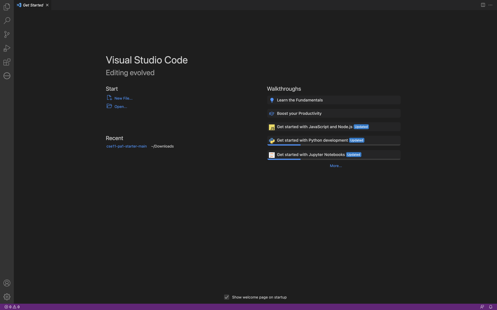
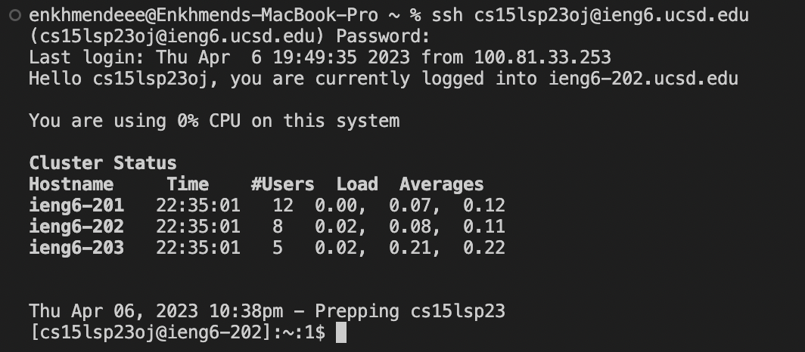

# CSE15L Remote Access Tutorial
## by kei
**Step 1**
* Log into [this](https://sdacs.ucsd.edu/~icc/index.php) to look up your course-specific account.
* Reset your password.

**Step 2**
* Go to [this](https://code.visualstudio.com/) link to download VS.
* Then you will be greeted with a window like this.

**Step 3**
* Open up the terminal by from the new terminal menu option.
* Type in this line of code to use ssh.
* `$ ssh cs15lsp23zz@ieng6.ucsd.edu`
* Above code's `zz` is to be replaced by your CSE15L account's username from step 1.
* And type in yes
* Then enter your password
* Then if you are successful, you should see a terminal like this.

**Step 4**
* Try running some commands on the terminal like `cd ~`,`cd`,`ls -lat`,`ls -a`
* Terminal will produce something like this:
* 
