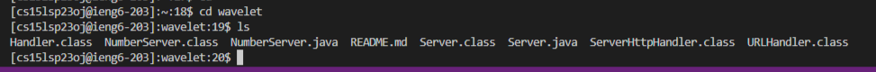
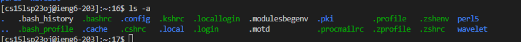
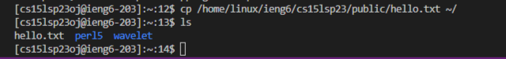

# CSE15L Remote Access Tutorial
## by kei
**Step 1**
* Log into [this](https://sdacs.ucsd.edu/~icc/index.php) to look up your course-specific account.
* Reset your password.

**Step 2**
* Go to [this](https://code.visualstudio.com/) link to download VS.
* Then you will be greeted with a window like this.

**Step 3**
* Then you have to open the terminal in order to access the remote server.
* Open up the terminal by from the new terminal menu option.
* Type in this line of code to use ssh.
* `$ ssh cs15lsp23zz@ieng6.ucsd.edu`
* Above code's `zz` is to be replaced by your CSE15L account's username from step 1.(zz=oj for me)
* And type in yes
* Then enter your password
* Then if you are successful, you should see a terminal like this.

**Step 4**
* Try running some commands on the terminal like `cd ~`,`cd`,`ls -lat`,`ls -a`
1. The command `cd` stands for change directory. So, if you enter a command like `cd wavelet`, it changes your current directory to wavelet. And then you can see the wavelet directory's files by entering `ls`.

2. Terminal will produce something like this when you enter a command `ls -a`:

* This command shows all files on the server including hidden files. 
3. The command `cp` can be used to copy a file from a selected destination to an other destination.
* For example running the command `cp /home/linux/ieng6/cs15lsp23/public/hello.txt ~/` will copy the hello.txt file to our directory.
* We can check that using the `ls` command.
* 
* We can see that the hello.txt is added to our directory.
> You are done!
