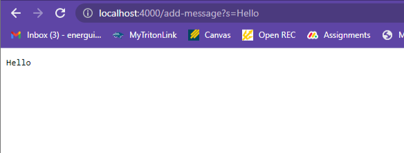
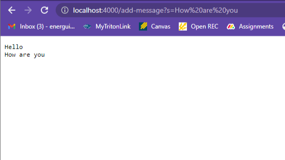
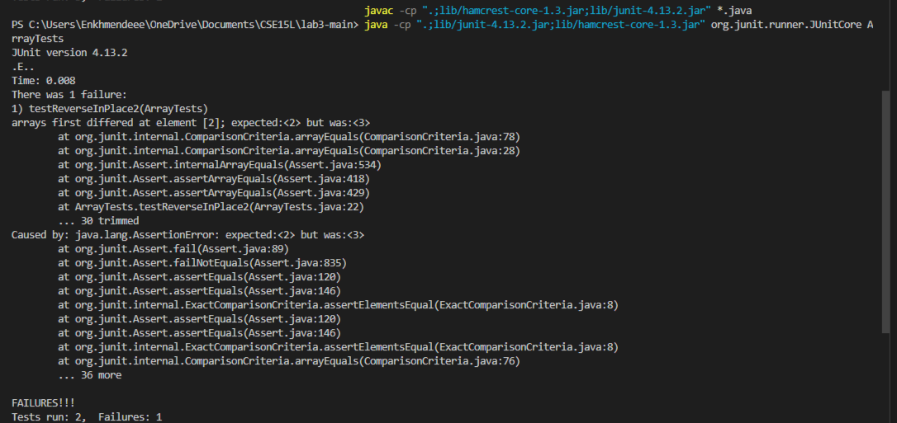

# CSE15L Lab Report 2
## by kei
## Part 1
String Server code
---
```
import java.io.IOException;
import java.net.URI;

class Handler implements URLHandler {
    // The one bit of state on the server: a number that will be manipulated by
    // various requests.
    String str = "";

    public String handleRequest(URI url) {
        if (url.getPath().contains("/add-message")) {
            String[] parameters = url.getQuery().split("=");
            if (parameters[0].equals("s")) {
                str += parameters[1]+"\n";
                return String.format(str);
            }
        }
        return "404 Not Found!";
    }
}

class StringServer {
    public static void main(String[] args) throws IOException {
        if(args.length == 0){
            System.out.println("Missing port number! Try any number between 1024 to 49151");
            return;
        }

        int port = Integer.parseInt(args[0]);

        Server.start(port, new Handler());
    }
}
```
**2 screenshots of using /add-message**
1. 
2. 
* **Answers**
* Firstly, the main method of the StringServer class is called and a web server is initialized. It takes 1 argument which becomes the port. 
* For the first screenshot, the method `handleRequest` is called with the url `http://localhost:4000/add-message?s=Hello`. Then, the path,`/add-message?s=Hello`, contains the string `/add-message` so it proceeds the identify the query field. For this request, the query is `s=Hello` and then it is split into 2 parameters by the `=` sign. Since the first parameter is `s`, it concatenates the second parameter `Hello` to the str variable and new line is also concatenated to return outputs according to next requests in new line. The variable str is initialized as a empty string and it changes everytime a `/add-message` request is called. Then, the str variable is returned so it can be seen on the web server.
1. `handleRequest(http://localhost:4000/add-message?s=Hello)` method is called.
2. `url.getPath()` is called to get the path of the url. It returns `/add-message?s=Hello`.
3. `url.getPath().contains("/add-message")` method is called to check if the path contains the appropriate request. It returns `true`.
4. `url.getQuery()` method is called to seperate the query part from the url. It returns `s=Hello`.
5. `url.getQuery().split("=")` method is called so it can seperate the query fields. It returns an array with elements `"s","Hello"`.
6. `parameter[0].equals("s")` method is called to check if the query field is the appropriate one. It returns `true`.
7. `String.format(str)` method is called to format the value to a appropriate value for web server to output. 
* For the 2nd screenshot, the path is changed to `/add-message?s=How are you`. So the method `handleRequest` is called again with the url parameter `http://localhost:4000/add-message?s=How are you`.
1. `handleRequest(http://localhost:4000/add-message?s=How are you)` method is called.
2. `url.getPath()` is called to get the path of the url. It returns `/add-message?s=How are you`.
3. `url.getPath().contains("/add-message")` method is called to check if the path contains the appropriate request. It returns `true`.
4. `url.getQuery()` method is called to seperate the query part from the url. It returns `s=How are you`.
5. `url.getQuery().split("=")` method is called so it can seperate the query fields. It returns an array with elements `"s","How are you"`.
6. `parameter[0].equals("s")` method is called to check if the query field is the appropriate one. It returns `true`.
7. `String.format(str)` method is called to format the value to a appropriate value for web server to output. 
 Arguments like `url`, `"add-message"`,`"="` don't change because the relative methods return different object. Only the variable `str` changes after the method `handleRequest(url)` is called. 
## Part 2
I'll choose the first array method reverseInPlace for this part.
* A failure inducing input. 
1. Buggy code
```
static void reverseInPlace(int[] arr) {
    for(int i = 0; i < arr.length; i += 1) {
      arr[i] = arr[arr.length - i - 1];
    }
  }
```
2. Failure inducing input with Junit test.
```
@Test
  public void testReverseInPlace2(){
    int[] input2 = {1,2,3,4};
    ArrayExamples.reverseInPlace(input2);
    assertArrayEquals(new int[]{4,3,2,1}, input2);
  }
```
* A input that doesn't induce a failure.
```
@Test 
	public void testReverseInPlace() {
    int[] input1 = { 3 };
    ArrayExamples.reverseInPlace(input1);
    assertArrayEquals(new int[]{ 3 }, input1);
	}
```
* Symptom when running 2 inputs above

* Before and after of the code 
```
static void reverseInPlace(int[] arr) {
    for(int i = 0; i < arr.length; i += 1) {
      arr[i] = arr[arr.length - i - 1];
    }
  }
```
```
static void reverseInPlace(int[] arr) {
    for(int i = 0; i < arr.length/2; i += 1) {
      int temp;
      temp=arr[i];
      arr[i] = arr[arr.length - i - 1];
      arr[arr.length - i - 1]=temp;
    }
  }
```
* The initial code was mirroring the first half of the array to the second half of the array. So I fixed it by limiting the for loop iterations to half of the array's length and adding a temporary variable to store the element that was being replaced. 
## Part 3
* By attending week 2 and 3 labs, I learned how to publish pages on github and pushing, cloning and forking a repository. Also, I learned how to create my own web server and how to manipulate it. Additionally, I learned how to run jUnit tests. 
