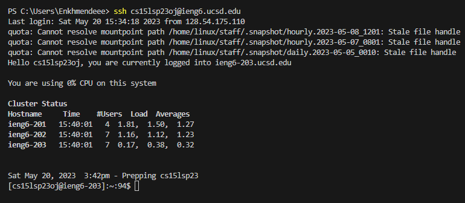
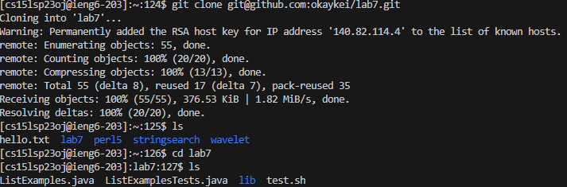
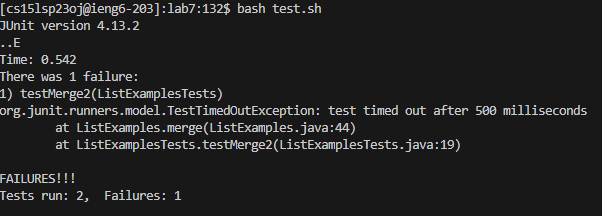
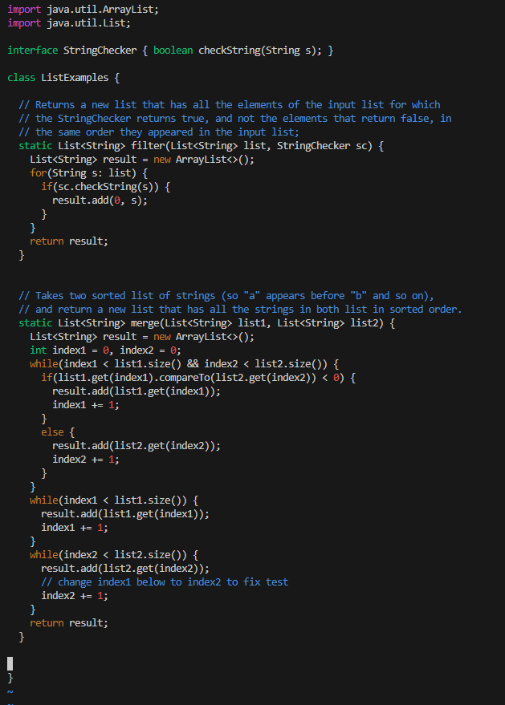
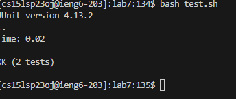
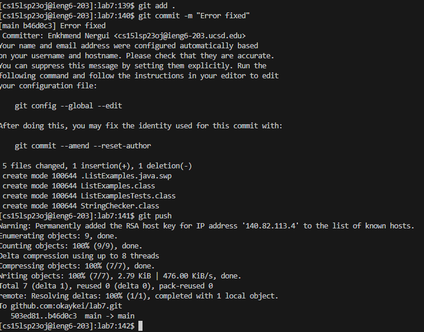

# Lab 4 Report by kei
## Step 4 Log into ieng6
1. Open up the terminal and type in `ssh cs15lsp23oj@ieng6.ucsd.edu` and press enter. 

## Step 5 Clone your fork of the repository from your Github account
1. Fork the repository `https://github.com/ucsd-cse15l-s23/lab7` 
2. Then clone the repository using this command `git clone git@github.com:okaykei/lab7.git`.

## Step 6 Run the tests, demonstrating that they fail
1. Run the test using the bash command test.sh `bash test.sh`

## Step 7 Edit the code file to fix the failing test
1. Type in the command `vim `
2. Click on the error occuring `index1` to place your cursor.
3. Press `<x>` to delete 1.
4. Then, press `<i>` to enter insert mode.
5. Then, press `<2>` to make it `index2`
6. Then, press `<esc>` to go back to normal mode.
7. Then, `<:><w><enter>` to save the change.
8. Then, `<:><q><!>` to quit vim. 

## Step 8 Run the tests, demonstrating that they now succeed
1. Type in the bash command again `bash test.sh`and press enter.

## Step 9 Commit and push the resulting change to your Github account 
1. Check the status by the command `git status`. Then it shows that there are changes that made without commit.
2. Make the changes by the command `git add .`.
3. Then commit using the command ``.
4. Push the changes by the command `git push`.

